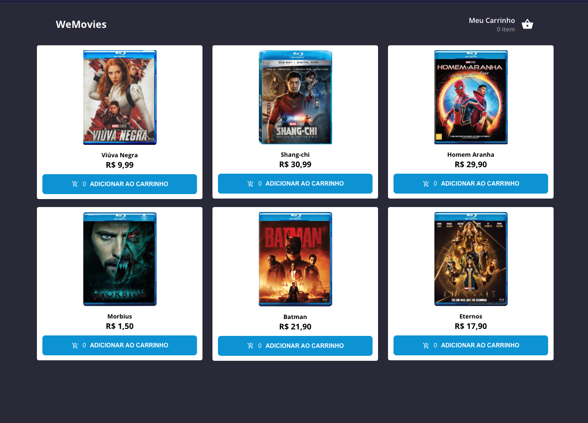

<p align="center">
  Projeto para os desafios de Estruturação de Projeto React + TypeScript + styled-components para a WeFit
</p>
<br>

# Sobre o projeto

O desafio consiste na criação de um site de e-commerce simplificado do zero, onde o candidato terá que criar um fluxo com três módulos/telas.

São elas:

- Home: Onde ele terá que fazer uma requisição na API, trazendo assim, a lista de filmes quem podem ser adicionados ao carrinho.

- Carrinho: Onde ele poderá ver os itens que foram adicionados, somando o valor total com base em cada item adicionado, podendo remover um item do carrinho. Por padrão, se o carrinho tiver nenhum item adicionado, deverá aparecer a tela de empty com a opção de voltar para tela inicial.

- Compra realizada: Após confirmar o pedido na tela anterior, o usuário deverá ser encaminhado para a tela de pedido confirmado. Aqui o usuário também terá a opção de voltar para tela inicial.
  Protótipo do Figma

Sobre a API

Para o desafio, foi simulado uma API, através do JSON Server, onde o usuário pode simular todas as ações e salvando os dados na pasta

```
./src/database/server.json
```

<br>

# Acesso ao projeto

<br>

<p align="center">
  
</p>
<br>

# Tecnologias utilizadas

- Typescript
- React
- React Router DOM
- Styled Components
- ContextAPI
- ESLint

# Inicialização

Para clonar o repositório, rode o seguinte comando no terminal:

```
git clone https://github.com/GersonRocha9/wefit-frontend-challenge.git
```

Para rodar o projeto, entre na pasta do diretório raiz, e rode o comando para instalar as dependências:

```
cd wefit-react-challenge
yarn
```

Agora para iniciar o projeto, rode o comando:

```
yarn dev
```

E para rodar o servidor, rode o comando:

```
yarn server
```
